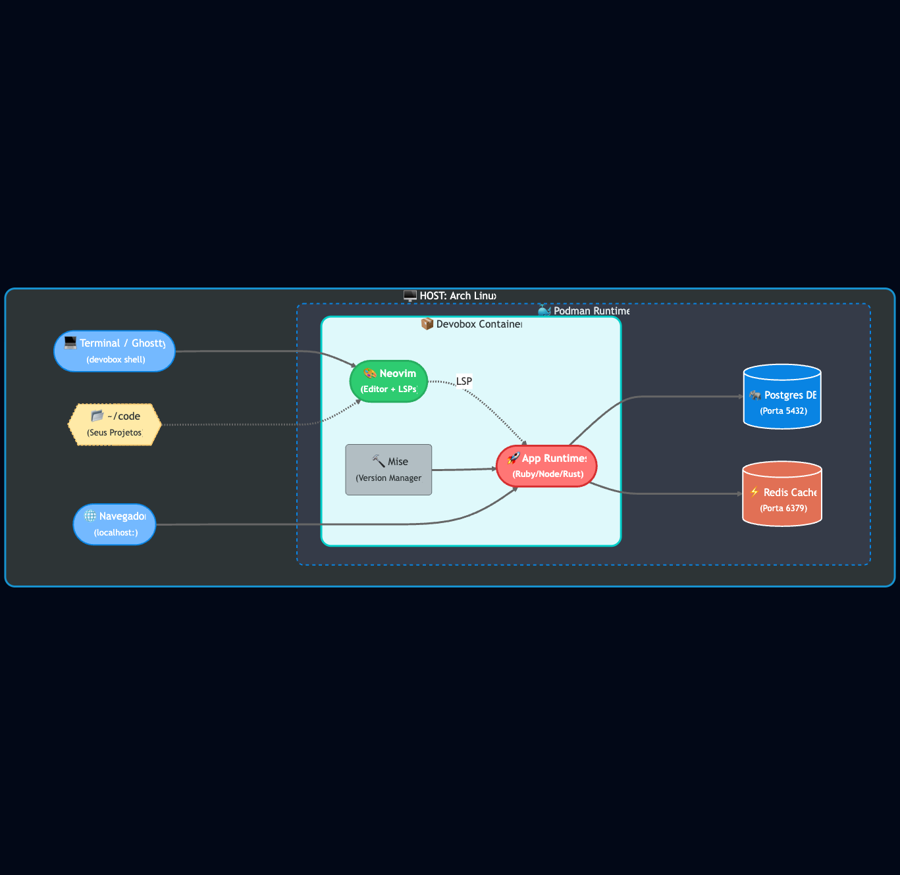

# 📦 Devobox

**Estação de Trabalho Híbrida para Desenvolvimento no Linux**



> _Desenvolva sem poluir seu sistema, sem perder performance e sem reinventar o ambiente a cada projeto._

## O que é Devobox?

Devobox é uma ferramenta que cria um **segundo computador dentro do seu Linux** — isolado, persistente e rápido.

Pense nele como:

- ✅ Um ambiente de desenvolvimento que **nunca quebra** com updates do sistema
- ✅ Velocidade de I/O e rede **100% nativa** (zero overhead de VM)
- ✅ Um **pet digital** que lembra de tudo (histórico shell, ferramentas, estado)
- ✅ Um **maestro inteligente** que sobe seus serviços na ordem certa

**A diferença:** Você não trata esse container como algo descartável. Ele é seu espaço de trabalho permanente, mas com a higiene e reprodutibilidade de containers.

---

## A Arquitetura: Hub & Spoke

Imagine uma roda de bicicleta:

```
                ┌──────────────────────┐
                │   🖥️  SEU PC         │
                │   (Kernel + GUI)     │
                └──────────┬───────────┘
                           │
                  ┌────────▼────────┐
                  │   📦 HUB        │
                  │   (devobox)     │  ← Você trabalha aqui
                  │   • Código      │
                  │   • Tools       │
                  │   • Shell       │
                  └────────┬────────┘
                           │
          ┌────────────────┼────────────────┐
          │                │                │
      ┌───▼───┐        ┌───▼───┐       ┌───▼───┐
      │ 🗄️ PG │        │ 🔴 R  │       │ 📮 MH │  ← Satellites
      │ :5432 │        │ :6379 │       │ :8025 │  ← Auto-start
      └───────┘        └───────┘       └───────┘
```

- **Hub (centro):** Seu workspace onde você escreve código
- **Spokes (satélites):** Serviços como Postgres, Redis que sobem quando necessário

Tudo isolado. Tudo persistente. Zero fricção.

---

## 🏛️ Os 4 Pilares do Devobox

### 1. 🧹 Higiene Absoluta do Host

**O cenário:**
No Arch Linux (ou qualquer rolling release), as bibliotecas do sistema (`openssl`, `libicu`, `glibc`) atualizam constantemente. Se você instala Ruby, Node ou Python direto no host, um update pode quebrar tudo.

**A solução:**
Isolar **100%** das runtimes de linguagem e bibliotecas dentro do container.

- Seu Host fica apenas com: Kernel, Drivers, GUI, Editor e Navegador
- O resto (gems, node_modules, compiladores) fica contido
- Se o container quebrar: `devobox rebuild`. Seu PC continua intacto

**O benefício:** Nunca mais perca uma manhã inteira por causa de um update de biblioteca.

---

### 2. ⚡ Performance Nativa

**O cenário:**
Muitas soluções Docker (como Docker Desktop) rodam dentro de uma VM oculta. Isso torna `npm install` e `bundle install` dolorosamente lentos.

**A solução:**
Aproveitar o Linux para usar **Bind Mounts nativos** e **Network Host**.

- **I/O:** O container lê arquivos na mesma velocidade que o host. Zero overhead
- **Rede:** Com `--network host`, removemos o NAT. O `localhost` do container **é** o `localhost` do seu PC

**O benefício:** Trabalhe na velocidade do seu SSD, não na velocidade de um driver de virtualização.

---

### 3. 🐕 Filosofia "Pet" vs "Cattle"

**O cenário:**
Containers Docker tradicionais são tratados como gado (cattle) — descartáveis e efêmeros. Toda vez que você derruba o container, perde:

- Histórico do terminal (Ctrl+R)
- Aliases temporários
- Ferramentas de debug instaladas

**A solução:**
Criar um **Pet Container** — um ambiente persistente que se comporta como um segundo computador.

- Define ferramentas em `mise.toml` (reprodutível)
- O container é imutável mas sempre disponível
- Histórico, estado e sessões persistem via Zellij

**O benefício:** Entre e saia quando quiser. Tudo estará exatamente como você deixou.

---

### 4. 💾 Orquestração Inteligente

**O cenário:**
Trabalhar com microserviços geralmente significa:

- Múltiplos `docker-compose.yml` espalhados
- 3 instâncias de Postgres rodando (desperdício de RAM)
- Erros de "Connection Refused" porque a app sobe antes do banco

**A solução:**
Um orquestrador com healthchecks ativos e controle granular.

- **Healthchecks:** Devobox espera ativamente até que serviços estejam prontos
- **Separação clara:** Bancos (pesados) vs Serviços (leves)
- **Configuração em cascata:** Global para o dia a dia, local para projetos
- **Dependências entre projetos:** Um projeto pode importar a infraestrutura de outro

**O benefício:** Seus serviços sobem na ordem certa. Sempre.

---

## 🚀 Instalação Rápida

### Requisitos

- **Podman** instalado
- **Linux** (otimizado para Arch, funciona em Ubuntu/Fedora)
- `~/.local/bin` no seu PATH

### Método 1: Via Release (Recomendado)

```bash
# Baixar e instalar
curl -L https://github.com/JohnAnon9771/devobox/releases/latest/download/x86_64-unknown-linux-gnu.tar.gz -o devobox.tar.gz
tar -xzf devobox.tar.gz
chmod +x devobox
mv devobox ~/.local/bin/devobox
rm devobox.tar.gz

# Adicionar ao PATH (se necessário)
echo 'export PATH="$HOME/.local/bin:$PATH"' >> ~/.bashrc && source ~/.bashrc

# Setup completo
devobox init
```

### Método 2: Compilar do Fonte

```bash
git clone https://github.com/JohnAnon9771/devobox.git
cd devobox
cargo build --release
install -Dm755 ./target/release/devobox ~/.local/bin/devobox
devobox init
```

### O que `devobox init` faz?

1. Cria configs em `~/.config/devobox`
2. Constrói imagem base Debian com ferramentas do `mise.toml`
3. Prepara containers de serviço
4. Tudo pronto em ~5 minutos

**Protip:** Se você rodar `devobox` sem setup, ele detecta e executa `init` automaticamente!

---

## 🎯 O que Você Pode Fazer?

### 🧹 Manter Seu Sistema Limpo

Instale Node 20, Ruby 3.2, Python 3.11 sem tocar no seu OS host.

```bash
devobox
mise install node@20 ruby@3.2 python@3.11
```

Tudo fica isolado. Seu sistema continua pristine.

---

### ⚡ Trabalhar em Velocidade Nativa

```bash
devobox
cd ~/code/meu-projeto
npm install  # Velocidade total do seu SSD
npm run dev  # localhost:3000 — sem mapeamento de portas
```

Zero overhead de virtualização. É como desenvolvimento local, mas isolado.

---

### 🎯 Gerenciar Múltiplos Projetos

```bash
devobox project list           # Ver projetos em ~/code
devobox project up frontend    # Ativar workspace do projeto
```

Cada projeto tem:

- Sessão Zellij dedicada
- Serviços próprios
- Variáveis de ambiente específicas

---

### 🏗️ Orquestrar Microsserviços

Exemplo: Frontend Vue consumindo Backend Rails.

```toml
# ~/code/frontend/devobox.toml
[project]
startup_command = "npm run dev"

[dependencies]
include_projects = ["../backend-api"]

[services.frontend-cache]
image = "redis:7"
ports = ["6380:6379"]
```

```bash
devobox project up frontend
# ✓ Backend API sobe automaticamente
# ✓ Redis cache inicia
# ✓ Tudo em abas separadas no Zellij
```

---

## 🛠️ Comandos Essenciais

### Uso Diário

```bash
devobox              # Abre shell (auto-setup se necessário)
devobox -d           # Abre shell COM todos os serviços
devobox shell        # Shell sem auto-start de serviços
```

### Gerenciar Ambiente

```bash
devobox init         # Setup inicial completo
devobox rebuild      # Reconstrói imagem e containers
devobox status       # Ver status de todos containers
```

### Gerenciar Containers

```bash
devobox up           # Sobe tudo
devobox down         # Para tudo
devobox up --dbs-only       # Apenas bancos de dados
devobox up --services-only  # Apenas serviços genéricos
```

### Controle Granular

```bash
# Bancos de dados (type: database)
devobox db start     # Todos os bancos
devobox db start pg  # Apenas Postgres
devobox db stop

# Serviços genéricos
devobox service start
devobox service stop
```

### Gerenciar Projetos

```bash
devobox project list       # Listar projetos em ~/code
devobox project up myapp   # Ativar projeto
devobox project info       # Ver contexto atual
```

### Limpeza

```bash
devobox cleanup            # Limpa recursos não usados
devobox cleanup --nuke     # ⚠️ Reset completo do Podman
```

### Modo Auto-Stop

Economize recursos parando containers automaticamente ao sair:

```bash
devobox -d --auto-stop
# [trabalha...]
exit
# ✓ Todos containers param automaticamente
```

---

## 📁 Configuração

### Cascata: Global → Local → Projeto

1. **Global:** `~/.config/devobox/devobox.toml` (defaults para todo o sistema)
2. **Local:** `./devobox.toml` (overrides específicos do projeto)

### Exemplo de Projeto

```bash
~/code/meu-app/
├── devobox.toml
└── src/
```

```toml
# ~/code/meu-app/devobox.toml

[project]
env = ["NODE_ENV=development", "DEBUG=app:*"]
shell = "zsh"
startup_command = "npm start"

[dependencies]
include_projects = [
    "../backend-api",
    "../auth-service"
]

[services.app-db]
type = "database"
image = "postgres:16"
ports = ["5432:5432"]
env = ["POSTGRES_PASSWORD=dev", "POSTGRES_DB=myapp"]
healthcheck_command = "pg_isready -U postgres"
healthcheck_interval = "5s"
healthcheck_timeout = "3s"
healthcheck_retries = 5

[services.app-cache]
image = "redis:7"
ports = ["6379:6379"]
```

### Tipos de Serviço

**Database (`type: database`):**

- Infraestrutura persistente (Postgres, MySQL, MongoDB)
- Controlado via `devobox db`
- Geralmente mais pesado

**Generic (padrão se `type` omitido):**

- Serviços auxiliares (Redis, Mailhog, mocks)
- Controlado via `devobox service`
- Geralmente mais leve

---

## 🔧 Stack Tecnológico

**Container Base:** Debian Trixie

**Ferramentas incluídas:**

- Neovim 0.11.5, Lazygit, Zellij
- Git, curl, wget, ssh, build-essential
- [Mise](https://mise.jdx.dev/) - gerenciador de runtimes (Node, Ruby, Python, Rust, Go, etc.)
- [Starship](https://starship.rs/) - prompt moderno

**Integrações:**

- SSH agent forwarding (Git just works™)
- User namespace mapping (sem problemas de permissão)
- Host networking (localhost é localhost)

---

## 📚 Documentação

### Novo no Devobox?

➡️ **[Guia de Início Rápido](docs/getting-started/index.md)** - De zero a produtivo em 15 minutos

### Quer entender conceitos?

➡️ **[Guia Completo](docs/guide/index.md)** - Workflows, comparações e tópicos avançados

### Precisa de exemplos práticos?

➡️ **[Cookbook](docs/cookbook/index.md)** - Receitas copy-paste para cenários comuns

### Contribuindo ou curioso?

➡️ **[Arquitetura](docs/architecture/index.md)** - Referência técnica completa

---

## 🥊 Devobox vs Docker Compose

### O que Devobox faz que Docker Compose NÃO faz?

#### 1. 🔗 **Cascata de Dependências entre Projetos**

**Docker Compose:**

```bash
# Precisa rodar manualmente cada projeto
cd ~/frontend && docker-compose up -d
cd ~/backend && docker-compose up -d
cd ~/auth && docker-compose up -d
```

**Devobox:**

```bash
# Um comando sobe tudo automaticamente
devobox project up frontend
# ✓ Frontend sobe
# ✓ Backend sobe (dependência automática)
# ✓ Auth sobe (dependência automática)
```

---

#### 2. 🎯 **Workspace Multi-Projeto com Terminal Integrado**

**Docker Compose:**

- Sobe containers
- Você gerencia terminais manualmente
- Sem organização de abas/sessões

**Devobox:**

```bash
devobox project up frontend
```

**Resultado:** Zellij com abas organizadas:

- **Aba 1:** Frontend (`npm run dev` rodando)
- **Aba 2:** Backend (`rails server` rodando)
- **Aba 3:** Auth (`node server.js` rodando)

Tudo em **uma sessão**, tudo **persistente**.

---

#### 3. ⏱️ **Healthcheck Ativo (CLI Espera Antes de Liberar)**

**Docker Compose:**

```bash
docker-compose up -d
# Retorna imediatamente
# Você tenta acessar: "Connection refused" ❌
# Precisa de wait-for-it.sh ou checar manualmente
```

**Devobox:**

```bash
devobox -d
# 🚀 Iniciando pg...
# 🩺 Aguardando pg... ✅ Saudável!
# Só libera shell quando REALMENTE pronto
```

---

#### 4. 🏷️ **Separação Semântica: Bancos vs Serviços**

**Docker Compose:**

```bash
# Sem separação. Você lista manualmente:
docker-compose up postgres redis mailhog
```

**Devobox:**

```bash
devobox db start        # Apenas Postgres, MySQL, MongoDB
devobox service start   # Apenas Redis, Mailhog, auxiliares
devobox up --dbs-only   # Controle granular
```

---

#### 5. 🔍 **Auto-Discovery de Projetos**

**Docker Compose:**

- Você precisa saber onde está cada `docker-compose.yml`

**Devobox:**

```bash
devobox project list
# Escaneia ~/code automaticamente
# Lista todos os projetos com devobox.toml
```

---

#### 6. 🎭 **Hub & Spoke Pattern (Container Singleton)**

**Docker Compose:**

- Todo `docker-compose up` cria novos containers
- Estado não persiste entre sessões

**Devobox:**

- 1 Hub reutilizado (singleton)
- Shell injection (`podman exec`) em vez de recriar
- Estado preservado (histórico, ferramentas instaladas)

---

### Tabela Comparativa

| Feature                     | Docker Compose          | Devobox                          |
| --------------------------- | ----------------------- | -------------------------------- |
| **Cascata de dependências** | ❌ Manual               | ✅ `include_projects` automático |
| **Terminal multi-projeto**  | ❌ Você gerencia        | ✅ Zellij integrado              |
| **Startup orchestration**   | 🟡 command básico       | ✅ Abas + startup_command        |
| **Healthcheck wait**        | ❌ Não bloqueia         | ✅ Espera ativamente             |
| **Agrupamento semântico**   | ❌ Lista flat           | ✅ db vs service                 |
| **Project discovery**       | ❌ Manual               | ✅ Auto-scan                     |
| **Hub singleton**           | ❌ Recria sempre        | ✅ Reusa container               |
| **User namespace (padrão)** | 🟡 `user: "1000:1000"`  | ✅ Automático                    |
| **Host network (padrão)**   | 🟡 `network_mode: host` | ✅ Automático                    |
| **Flexibilidade total**     | ✅ Configure tudo       | 🟡 Opinionated                   |
| **Multi-plataforma**        | ✅ Linux/Mac/Windows    | 🔴 Linux only                    |

---

### Quando usar cada um?

**Use Docker Compose se você precisa:**

- ✅ Rodar em Mac/Windows
- ✅ Máxima flexibilidade
- ✅ Paridade com produção
- ✅ Ecossistema universal

**Use Devobox se você quer:**

- ✅ Linux nativo
- ✅ Múltiplos projetos interdependentes
- ✅ Terminal multiplexado integrado
- ✅ Zero-config, convenção sobre configuração
- ✅ Workflow "pet container"

[Leia a comparação completa com exemplos](docs/guide/index.md#parte-4-comparações-detalhadas)

---

## 🐛 Troubleshooting Rápido

### Container não inicia

```bash
podman logs devobox
devobox rebuild
```

### Performance lenta de I/O (Btrfs/ZFS)

```bash
sudo chattr +C ~/.local/share/containers/storage
```

### Permissões de arquivo

Devobox usa `--userns=keep-id` para mapear seu UID. Arquivos criados no container pertencem a você no host. Se tiver problemas, verifique se Podman está configurado corretamente para user namespaces.

---

## 🤝 Contribuindo

Contribuições são bem-vindas! Abra issues para bugs ou sugestões, e PRs para melhorias.

**Licença:** MIT

**Repositório:** https://github.com/JohnAnon9771/devobox

---

**Desenvolvido para profissionais que valorizam controle, performance e higiene do sistema.**

> _"Pare de lutar contra seu sistema. Comece a construir."_
