# 🏗️ Arquitetura do Devobox

> Documentação técnica completa da arquitetura, componentes e decisões de design do Devobox

## Índice

- [1. Visão Geral do Sistema](#1-visão-geral-do-sistema)
- [2. Arquitetura em Camadas](#2-arquitetura-em-camadas)
- [3. Modelo de Domínio](#3-modelo-de-domínio)
- [4. Sistema de Configuração](#4-sistema-de-configuração)
- [5. Modos de Operação](#5-modos-de-operação)
- [6. Arquitetura de Rede](#6-arquitetura-de-rede)
- [7. Container Lifecycle Management](#7-container-lifecycle-management)
- [8. Service Orchestration](#8-service-orchestration)
- [9. Build System](#9-build-system)
- [10. CLI Interface](#10-cli-interface)
- [11. Padrões Arquiteturais](#11-padrões-arquiteturais)
- [12. Referências de Código](#12-referências-de-código)
- [13. Decisões Arquiteturais](#13-decisões-arquiteturais)

---

## 1. Visão Geral do Sistema

### 1.1 Propósito e Filosofia

O Devobox é um **gerenciador de ambientes de desenvolvimento containerizados** construído em Rust que elimina a complexidade do Docker Desktop mantendo a portabilidade e isolamento de containers. Sua filosofia central é:

- **Simplicidade sobre configuração**: Zero-config para casos comuns
- **Performance nativa**: Rede host e bind mounts diretos
- **Hygiene do sistema**: Containers isolados sem poluir o OS
- **Experiência de desenvolvedor**: CLI ergonômico e feedback visual

### 1.2 Hub & Spoke Pattern

O Devobox implementa uma arquitetura **"Hub & Spoke"** (Cubo e Raios):

- **Hub**: Container singleton persistente que funciona como workspace de desenvolvimento
- **Spokes**: Containers isolados para serviços de infraestrutura (databases, cache, etc)

```
        [Hub Container]
       /      |      \
      /       |       \
[Postgres] [Redis] [Mailhog]
  (Spoke)  (Spoke)  (Spoke)
```

### 1.3 Stack Tecnológica

| Componente           | Tecnologia      | Versão | Propósito                                   |
| -------------------- | --------------- | ------ | ------------------------------------------- |
| **Runtime**          | Rust            | 1.70+  | Performance e segurança de tipos            |
| **Container Engine** | Podman          | 4.0+   | Daemonless, rootless containers             |
| **CLI Framework**    | Clap            | 4.5    | Parsing de argumentos                       |
| **Config**           | TOML + YAML     | -      | Arquivos de configuração                    |
| **Base Image**       | Debian Bookworm | 12     | Sistema operacional do container            |
| **Version Manager**  | Mise            | Latest | Gerenciamento de runtimes (Node, Ruby, etc) |

### 1.4 Decisões Arquiteturais Chave

1. **Podman em vez de Docker**: Daemonless, rootless, compatível com OCI
2. **Rust para CLI**: Performance, cross-platform, ecossistema cargo
3. **Rede híbrida**: Host para Hub (performance), Bridge para services (isolamento)
4. **User namespaces**: Mapeia UID container → host, elimina problemas de permissão
5. **Bind mounts**: Code editable no host, visível no container em tempo real
6. **Singleton Hub**: Um único container reutilizado, shell injection via `podman exec`

---

## 2. Arquitetura em Camadas

O Devobox segue uma arquitetura em camadas clean com separação clara de responsabilidades:

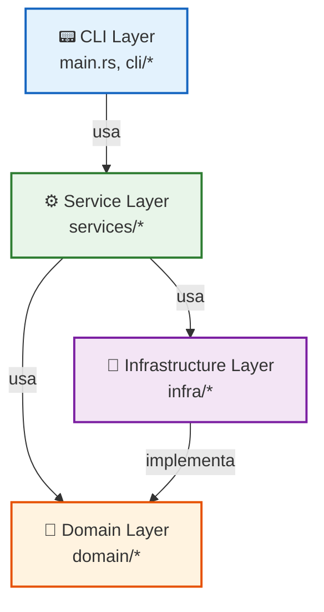

### 2.1 CLI Layer (`src/cli/`)

Camada de interface com o usuário. Responsável por:

- Parsing de argumentos e comandos
- Validação de inputs
- Feedback visual (spinners, progress bars)
- Orquestração de workflows complexos

**Arquivos principais:**

- `main.rs` - Entry point, definição de comandos com Clap
- `runtime.rs` - Comandos de runtime (shell, up, down, status)
- `builder.rs` - Comandos de build (init, build, rebuild)
- `setup.rs` - Comando de instalação inicial

### 2.2 Service Layer (`src/services/`)

Camada de lógica de negócio. Responsável por:

- Orquestração de operações complexas
- Healthcheck e validação de serviços
- Workflow de start/stop de múltiplos containers
- Cleanup e manutenção do sistema

**Arquivos principais:**

- `orchestrator.rs` - Orquestração de serviços, healthchecks
- `container_service.rs` - Operações de lifecycle de containers
- `system_service.rs` - Operações de sistema (build, cleanup)

### 2.3 Domain Layer (`src/domain/`)

Camada de modelo de domínio. Define:

- Entidades core (Container, Service, ContainerSpec)
- Enums e tipos de valor
- Traits e abstrações
- Regras de negócio independentes de infraestrutura

**Arquivos principais:**

- `container.rs` - Entidades: Service, ServiceKind, ContainerSpec, ContainerState
- `traits.rs` - Trait ContainerRuntime, ContainerHealthStatus

### 2.4 Infrastructure Layer (`src/infra/`)

Camada de infraestrutura. Responsável por:

- Implementação de traits de domínio
- Integração com Podman CLI
- Parsing e validação de configuração
- I/O com filesystem

**Arquivos principais:**

- `podman_adapter.rs` - Implementa ContainerRuntime via Podman CLI
- `config.rs` - Loading, parsing e validação de configs

---

## 3. Modelo de Domínio

### 3.1 Entidades Core

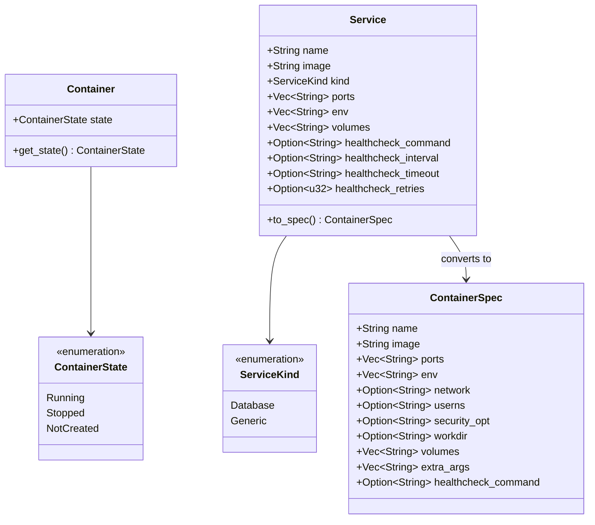

**Arquivo**: `src/domain/container.rs`

#### Container & ContainerState

```rust
#[derive(Debug, Clone, PartialEq, Eq)]
pub enum ContainerState {
    Running,    // Container está executando
    Stopped,    // Container existe mas está parado
    NotCreated, // Container ainda não foi criado
}

pub struct Container {
    pub state: ContainerState,
}
```

#### Service & ServiceKind

```rust
#[derive(Debug, Clone, Deserialize, PartialEq, Eq, Default)]
#[serde(rename_all = "lowercase")]
pub enum ServiceKind {
    #[default]
    Generic,   // Serviços genéricos (microservices, tools)
    Database,  // Serviços de banco de dados
}

#[derive(Debug, Clone, Deserialize, PartialEq, Eq)]
pub struct Service {
    pub name: String,
    pub image: String,
    #[serde(default, rename = "type")]
    pub kind: ServiceKind,
    #[serde(default)]
    pub ports: Vec<String>,
    #[serde(default)]
    pub env: Vec<String>,
    #[serde(default)]
    pub volumes: Vec<String>,
    pub healthcheck_command: Option<String>,
    pub healthcheck_interval: Option<String>,
    pub healthcheck_timeout: Option<String>,
    pub healthcheck_retries: Option<u32>,
}
```

#### ContainerSpec

```rust
#[derive(Debug, Clone)]
pub struct ContainerSpec<'a> {
    pub name: &'a str,
    pub image: &'a str,
    pub ports: &'a [String],
    pub env: &'a [String],
    pub network: Option<&'a str>,        // "host" ou "bridge"
    pub userns: Option<&'a str>,         // "keep-id" para mapeamento de UID
    pub security_opt: Option<&'a str>,   // "label=disable"
    pub workdir: Option<&'a str>,
    pub volumes: &'a [String],
    pub extra_args: &'a [&'a str],
    pub healthcheck_command: Option<&'a str>,
    pub healthcheck_interval: Option<&'a str>,
    pub healthcheck_timeout: Option<&'a str>,
    pub healthcheck_retries: Option<u32>,
}
```

**Referência**: `src/domain/container.rs:1-100`

### 3.2 Abstrações

#### ContainerRuntime Trait

**Arquivo**: `src/domain/traits.rs`

Define a interface para operações de containers:

```rust
pub trait ContainerRuntime: Send + Sync {
    // Queries de estado
    fn get_container(&self, name: &str) -> Result<Container>;
    fn get_container_health(&self, name: &str) -> Result<ContainerHealthStatus>;

    // Lifecycle
    fn start_container(&self, name: &str) -> Result<()>;
    fn stop_container(&self, name: &str) -> Result<()>;
    fn create_container(&self, spec: &ContainerSpec) -> Result<()>;
    fn remove_container(&self, name: &str) -> Result<()>;

    // Operações interativas
    fn exec_shell(&self, container: &str, workdir: Option<&Path>) -> Result<()>;

    // Sistema
    fn is_command_available(&self, cmd: &str) -> bool;
    fn build_image(&self, tag: &str, containerfile: &Path, context: &Path) -> Result<()>;

    // Cleanup
    fn prune_containers(&self) -> Result<()>;
    fn prune_images(&self) -> Result<()>;
    fn prune_volumes(&self) -> Result<()>;
    fn prune_build_cache(&self) -> Result<()>;
    fn nuke_system(&self) -> Result<()>;
}
```

#### ContainerHealthStatus

```rust
#[derive(Debug, Clone, PartialEq, Eq)]
pub enum ContainerHealthStatus {
    Healthy,        // Serviço respondendo corretamente
    Unhealthy,      // Serviço existe mas não responde
    Starting,       // Serviço inicializando
    Unknown,        // Não foi possível determinar
    NotApplicable,  // Sem healthcheck configurado
}
```

**Referência**: `src/domain/traits.rs:1-50`

---

## 4. Sistema de Configuração

### 4.1 Hierarquia de Configuração

O Devobox implementa um sistema de **configuração cascata** com três níveis:

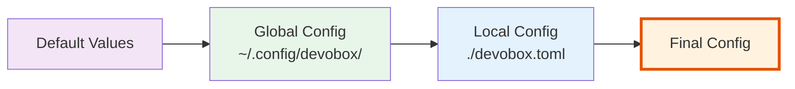

1. **Default Values**: Valores padrão hardcoded no código
2. **Global Config** (`~/.config/devobox/devobox.toml`): Configuração base para todos os projetos
3. **Local Config** (`./devobox.toml`): Overrides específicos do projeto

**Referência**: `src/infra/config.rs:load_app_config()`

### 4.2 Formatos Suportados

#### devobox.toml

```toml
[paths]
containerfile = "Containerfile"
services_yml = "services.yml"
mise_toml = "mise.toml"
starship_toml = "starship.toml"

[build]
image_name = "devobox-img"

[container]
name = "devobox"
workdir = "/home/dev"

[dependencies]
include_projects = ["../backend-api", "../auth-service"]
```

**Struct correspondente**:

```rust
pub struct AppConfig {
    pub paths: PathsConfig,
    pub build: BuildConfig,
    pub container: ContainerConfig,
    pub dependencies: DependenciesConfig,
}
```

#### services.yml

Suporta dois formatos YAML:

**Formato 1: Root com chave "services"**

```yaml
services:
  - name: pg
    type: database
    image: docker.io/postgres:16
    ports: ["5432:5432"]
    env:
      - POSTGRES_PASSWORD=dev
    volumes:
      - devobox_pg:/var/lib/postgresql/data
    healthcheck_command: "pg_isready -U postgres"
    healthcheck_interval: "5s"
    healthcheck_timeout: "3s"
    healthcheck_retries: 5
```

**Formato 2: Lista direta**

```yaml
- name: redis
  type: database
  image: docker.io/redis:7
  ports: ["6379:6379"]
```

**Referência**: `src/infra/config.rs:parse_services()`

### 4.3 Resolução de Dependências

O sistema resolve dependências recursivamente via `include_projects`:

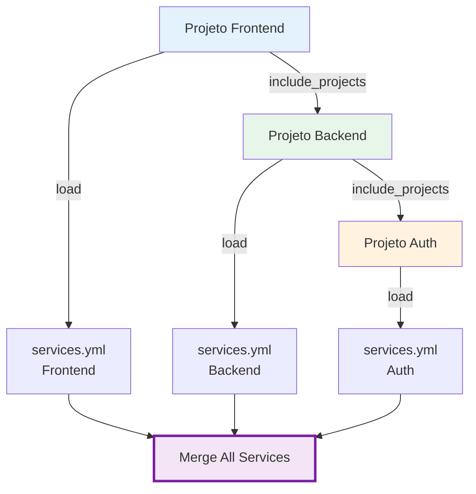

**Algoritmo** (`src/infra/config.rs:200-300`):

1. Load services do projeto atual
2. Para cada path em `include_projects`:
   - Load config do projeto dependente
   - Recursivamente load seus serviços
   - Track paths visitados (prevenção de ciclos)
3. Merge todos os serviços em uma lista única
4. Validar unicidade de nomes

**Código**:

```rust
pub fn resolve_all_services(
    start_dir: &Path,
    start_config: &AppConfig
) -> Result<Vec<Service>> {
    let mut visited = HashSet::new();
    let mut all_services = Vec::new();

    // Recursivamente resolve
    resolve_services_recursive(
        start_dir,
        start_config,
        &mut all_services,
        &mut visited
    )?;

    Ok(all_services)
}
```

**Referência**: `src/infra/config.rs:resolve_all_services()`

---

## 5. Modos de Operação

O Devobox opera em dois modos distintos dependendo da estratégia de desenvolvimento:

| Modo             | Quando Usar                           | Topologia        | Consumo RAM | Isolamento |
| ---------------- | ------------------------------------- | ---------------- | ----------- | ---------- |
| **Interativo**   | Desenvolvimento full-stack simultâneo | Hub único        | Baixo       | Baixo      |
| **Orquestração** | Foco em um projeto, outros como deps  | Hub + Satellites | Alto        | Alto       |

### 5.1 Modo Interativo (Hub Singleton)

**Cenário**: Você está trabalhando ativamente em múltiplos projetos ao mesmo tempo (ex: frontend + backend).

#### Topologia

Neste modo, **não são criados containers separados para suas aplicações**. Existe apenas **UM** container Hub rodando.

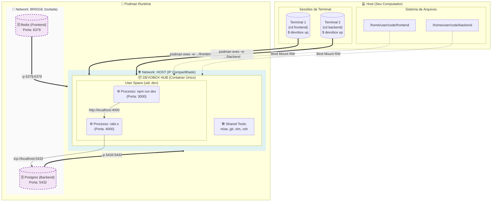

#### Detalhes do Funcionamento

1. **Singleton**: O Devobox verifica se o Hub já está rodando (`src/cli/runtime.rs`). Se sim, apenas injeta um novo shell.

2. **Portas**: Como o Hub usa `--network host` (`src/cli/builder.rs:87`), você gerencia portas manualmente (evitar conflitos).

3. **Comunicação**: Frontend chama Backend via `localhost:4000` pois compartilham interface de rede.

4. **Shell Injection**: Cada terminal executa `podman exec -it devobox bash`, todos dentro do mesmo container.

**Referência**: `src/cli/builder.rs:87` (network host), `src/cli/runtime.rs:150-250` (shell command)

### 5.2 Modo Orquestração (App as a Service)

**Cenário**: Você trabalha no Frontend, Backend roda em background como infraestrutura.

#### Topologia

Neste modo, dependências **saem** do Hub e ganham containers isolados:

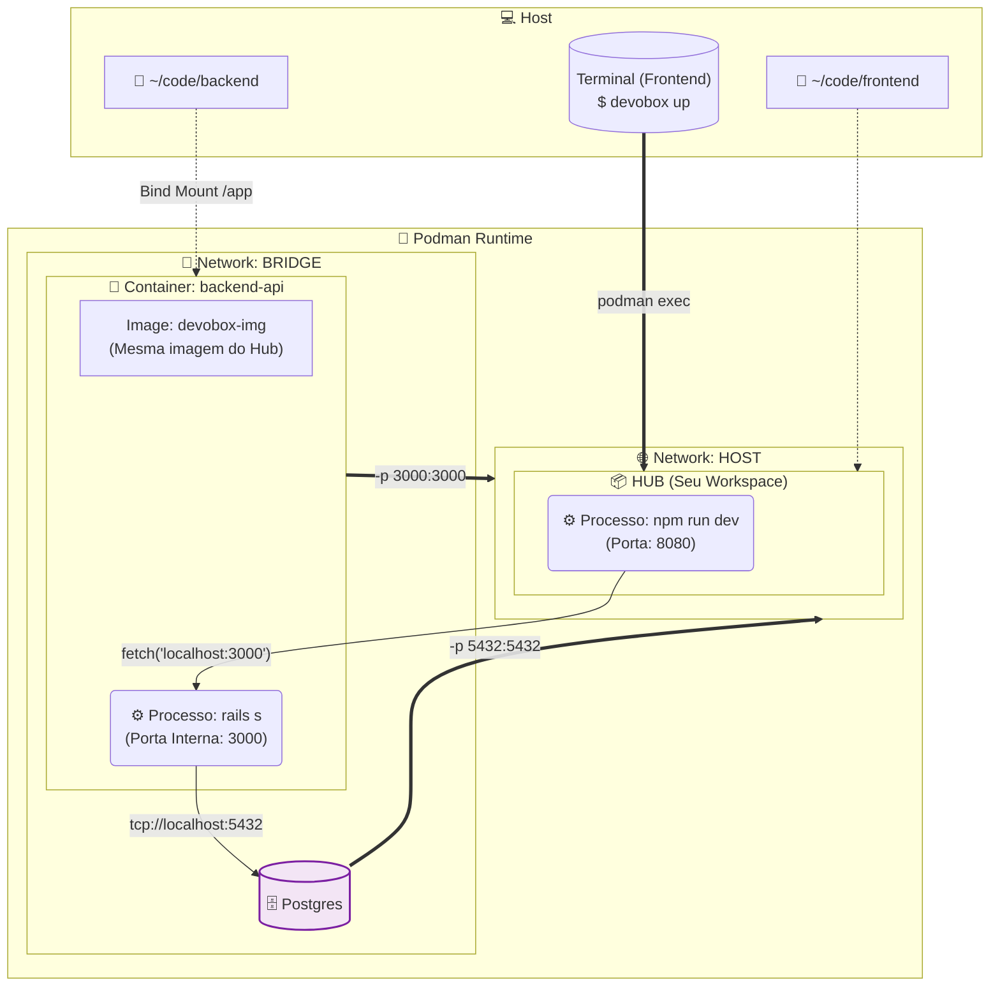

#### Detalhes do Funcionamento

1. **Isolamento**: Backend roda em processo separado com logs e env isolados.

2. **Automação**: Devobox roda `mise install` automaticamente dentro do satellite.

3. **Healthcheck**: Sistema bloqueia até Backend responder healthcheck (`src/services/orchestrator.rs:91-123`).

4. **Ativação**: Configurado via `include_projects` em `devobox.toml`.

**Referência**: `src/infra/config.rs:resolve_all_services()` (resolução de dependências)

### 5.3 Comparação Técnica

| Característica       | Modo Interativo          | Modo Orquestração            |
| -------------------- | ------------------------ | ---------------------------- |
| **Foco**             | Multitarefa (Full Stack) | Foco único (consumidor)      |
| **Onde roda App B?** | Processo no Hub          | Container dedicado (Bridge)  |
| **Acesso aos Logs**  | Terminal ativo           | `podman logs -f backend-api` |
| **Consumo RAM**      | Menor (1 container)      | Maior (1 container por app)  |
| **Isolamento**       | Baixo (compartilha env)  | Alto (ambiente limpo)        |
| **Uso Recomendado**  | Editando código de ambos | App B é apenas dependência   |

---

## 6. Arquitetura de Rede

### 6.1 Estratégia Híbrida

O Devobox implementa uma rede **híbrida**:

- **Host Network** para o Hub
- **Bridge Network** para Services

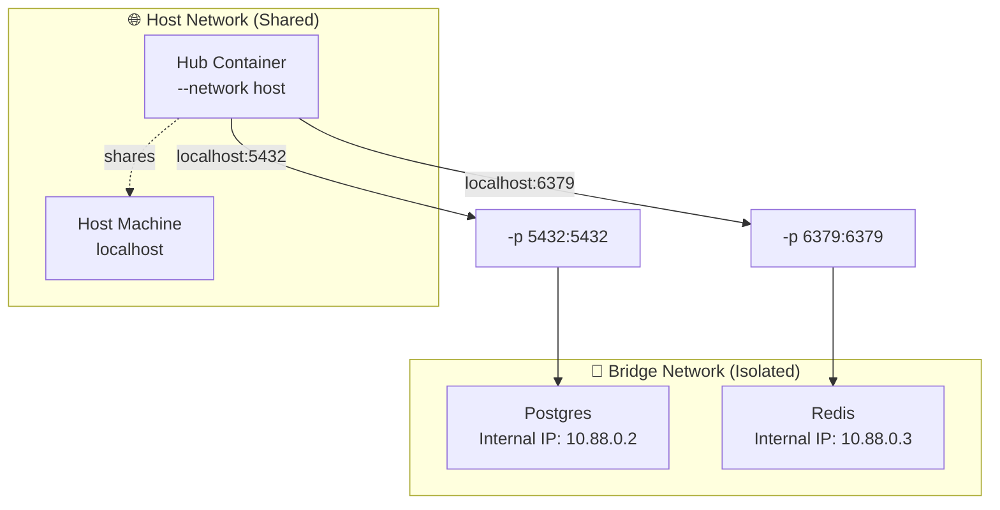

#### Por que Host Network no Hub?

**Decisão** (`src/cli/builder.rs:87`):

```rust
let dev_spec = ContainerSpec {
    name: "devobox",
    image: &image_name,
    network: Some("host"),  // <-- SEMPRE host
    // ...
};
```

**Razões**:

1. **Performance**: Sem overhead de NAT
2. **Simplicidade**: Portas diretas sem mapping
3. **Compatibilidade**: Apps funcionam como se estivessem no host

#### Por que Bridge Network em Services?

**Decisão** (`src/domain/container.rs:to_spec()`):

```rust
impl Service {
    pub fn to_spec(&self) -> ContainerSpec {
        ContainerSpec {
            network: None,  // <-- Bridge (default do Podman)
            ports: &self.ports,  // Port mapping aplicado
            // ...
        }
    }
}
```

**Razões**:

1. **Isolamento**: Databases não poluem rede do Hub
2. **Controle**: Port mapping explícito
3. **Segurança**: Containers isolados por padrão

**Referência**: `src/cli/builder.rs:87`, `src/infra/podman_adapter.rs:93-96`

### 6.2 Port Mapping

Port mapping é aplicado em services via flag `-p`:

**Código** (`src/infra/podman_adapter.rs:93-96`):

```rust
fn create_container(&self, spec: &ContainerSpec) -> Result<()> {
    let mut args = vec!["create", "--name", spec.name];

    // Port mapping
    for port in spec.ports {
        args.push("-p");
        args.push(port);  // Formato: "host:container"
    }

    // ...
}
```

**Exemplo**:

```yaml
# services.yml
- name: pg
  ports: ["5432:5432"] # Host 5432 → Container 5432
```

Resulta em comando:

```bash
podman create -p 5432:5432 postgres:16
```

### 6.3 Service Discovery

**Não há DNS service discovery**. Toda comunicação é via `localhost:port`.

```
Hub Process → localhost:5432 → Port Mapping → Postgres Container
Hub Process → localhost:3001 → Port Mapping → Backend Satellite
```

**Por que sem DNS?**

- Simplicidade: Sem complexidade de DNS resolver
- Portabilidade: URLs funcionam no host e no Hub
- Explicitness: Portas são documentadas em services.yml

### 6.4 Isolamento e Segurança

#### User Namespaces

**Configuração** (`src/cli/builder.rs:88`):

```rust
let dev_spec = ContainerSpec {
    userns: Some("keep-id"),  // <-- Mapeia UID
    // ...
};
```

**Efeito**:

- UID do usuário `dev` no container = UID do seu usuário no host
- Arquivos criados no container pertencem ao seu usuário no host
- **Zero problemas de permissão**

**Exemplo**:

```bash
# No container (UID 1000)
$ touch /home/dev/code/app.log

# No host (UID 1000)
$ ls -l code/app.log
-rw-r--r-- 1 joao joao 0 Dec 3 14:30 app.log  ✅
```

#### Security Options

**Configuração** (`src/cli/builder.rs:89`):

```rust
security_opt: Some("label=disable"),  // Desabilita SELinux labels
```

**Razão**: Permite acesso a bind mounts sem restrições de SELinux.

#### Volume Mounts

**Hub Mounts** (`src/cli/builder.rs:100-122`):

```rust
fn code_mount() -> Result<String> {
    let code_dir = env::var("DEVOBOX_CODE_DIR")
        .unwrap_or_else(|_| format!("{}/code", env::var("HOME").unwrap()));
    Ok(format!("{}:/home/dev/code", code_dir))
}

fn ssh_mount() -> Result<String> {
    let ssh_dir = format!("{}/.ssh", env::var("HOME").unwrap());
    Ok(format!("{}:/home/dev/.ssh:ro", ssh_dir))  // Read-only
}
```

**Mounts aplicados**:

- `$HOME/code:/home/dev/code` (RW) - Código editável
- `$HOME/.ssh:/home/dev/.ssh:ro` (RO) - Chaves SSH (apenas leitura)

---

## 7. Container Lifecycle Management

### 7.1 Estados e Transições

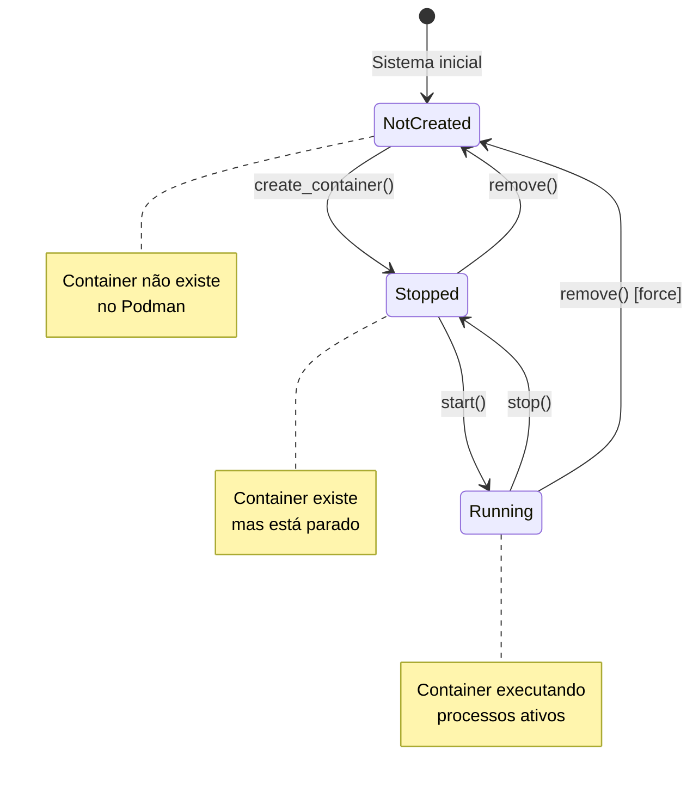

**Enum** (`src/domain/container.rs`):

```rust
pub enum ContainerState {
    NotCreated,  // Não existe
    Stopped,     // Existe mas parado
    Running,     // Executando
}
```

**Detecção de estado** (`src/infra/podman_adapter.rs`):

```rust
fn get_container(&self, name: &str) -> Result<Container> {
    if !container_exists(name)? {
        return Ok(Container { state: ContainerState::NotCreated });
    }

    if container_running(name)? {
        return Ok(Container { state: ContainerState::Running });
    }

    Ok(Container { state: ContainerState::Stopped })
}
```

### 7.2 Hub Container (Singleton)

O Hub implementa o **Singleton Pattern**:

```rust
// src/cli/runtime.rs
pub fn shell(&self, with_dbs: bool, auto_stop: bool) -> Result<()> {
    // 1. Verifica se Hub existe
    let container = self.container_service.get_container(&hub_name)?;

    match container.state {
        ContainerState::NotCreated => {
            // Auto-init se não existe
            println!("🚀 Hub não encontrado. Executando init...");
            self.init(skip_cleanup: false)?;
        }
        ContainerState::Stopped => {
            // Start se parado
            self.container_service.start(&hub_name)?;
        }
        ContainerState::Running => {
            // Já rodando, apenas injeta shell
        }
    }

    // 2. Shell injection
    let workdir = container_workdir()?;
    self.container_service.exec_shell(&hub_name, workdir.as_deref())?;
}
```

**Shell Injection** (`src/infra/podman_adapter.rs`):

```rust
fn exec_shell(&self, container: &str, workdir: Option<&Path>) -> Result<()> {
    let mut cmd = vec!["exec", "-it"];

    if let Some(wd) = workdir {
        cmd.push("-w");
        cmd.push(wd.to_str().unwrap());
    }

    cmd.extend(&[container, "bash"]);

    // Executa: podman exec -it -w /home/dev/code/frontend devobox bash
    std::process::Command::new("podman")
        .args(&cmd)
        .status()?;

    Ok(())
}
```

#### Workdir Resolution

**Código** (`src/cli/runtime.rs`):

```rust
fn container_workdir() -> Result<Option<PathBuf>> {
    let pwd = env::current_dir()?;
    let home = env::var("HOME")?;
    let code_dir = PathBuf::from(&home).join("code");

    // Se estamos em ~/code/frontend, mapeia para /home/dev/code/frontend
    if let Ok(relative) = pwd.strip_prefix(&code_dir) {
        return Ok(Some(PathBuf::from("/home/dev/code").join(relative)));
    }

    Ok(Some(PathBuf::from("/home/dev")))
}
```

**Exemplo**:

```bash
$ cd ~/code/frontend && devobox shell
# Container abre em: /home/dev/code/frontend ✅
```

**Referência**: `src/cli/runtime.rs:container_workdir()`

### 7.3 Service Containers

Services seguem lifecycle **declarativo**:

**Código** (`src/services/container_service.rs:40-80`):

```rust
impl ContainerService {
    pub fn ensure_running(&self, name: &str) -> Result<()> {
        let container = self.runtime.get_container(name)?;

        match container.state {
            ContainerState::Running => Ok(()),  // Já rodando
            ContainerState::Stopped => self.runtime.start_container(name),
            ContainerState::NotCreated => {
                bail!("Container {} não existe. Execute build primeiro.", name)
            }
        }
    }

    pub fn recreate(&self, spec: &ContainerSpec) -> Result<()> {
        // Remove se existe
        let _ = self.runtime.remove_container(spec.name);

        // Cria novo
        self.runtime.create_container(spec)?;

        Ok(())
    }
}
```

**Fluxo**:

1. **Build Phase**: `devobox build` cria todos os containers (estado: Stopped)
2. **Start Phase**: `devobox up` inicia containers + espera healthchecks
3. **Stop Phase**: `devobox down` para todos os containers

---

## 8. Service Orchestration

### 8.1 Tipos de Serviços

Services são classificados por `ServiceKind`:

```rust
pub enum ServiceKind {
    Database,  // Infraestrutura persistente
    Generic,   // Aplicações e tools
}
```

**Filtering por tipo**:

```bash
$ devobox up --dbs-only       # Apenas Database
$ devobox up --services-only  # Apenas Generic
$ devobox db start            # Apenas Database
$ devobox service start       # Apenas Generic
```

**Código** (`src/cli/runtime.rs`):

```rust
pub fn up(&self, opts: UpOptions) -> Result<()> {
    let mut services = self.services.clone();

    // Filtra por kind
    if opts.dbs_only {
        services.retain(|s| s.kind == ServiceKind::Database);
    } else if opts.services_only {
        services.retain(|s| s.kind == ServiceKind::Generic);
    }

    // Garante criados
    for svc in &services {
        self.ensure_svc_created(svc)?;
    }

    // Start + healthcheck
    self.orchestrator.start_all(&services)?;
}
```

### 8.2 Healthcheck System

O orchestrator implementa **polling ativo**:

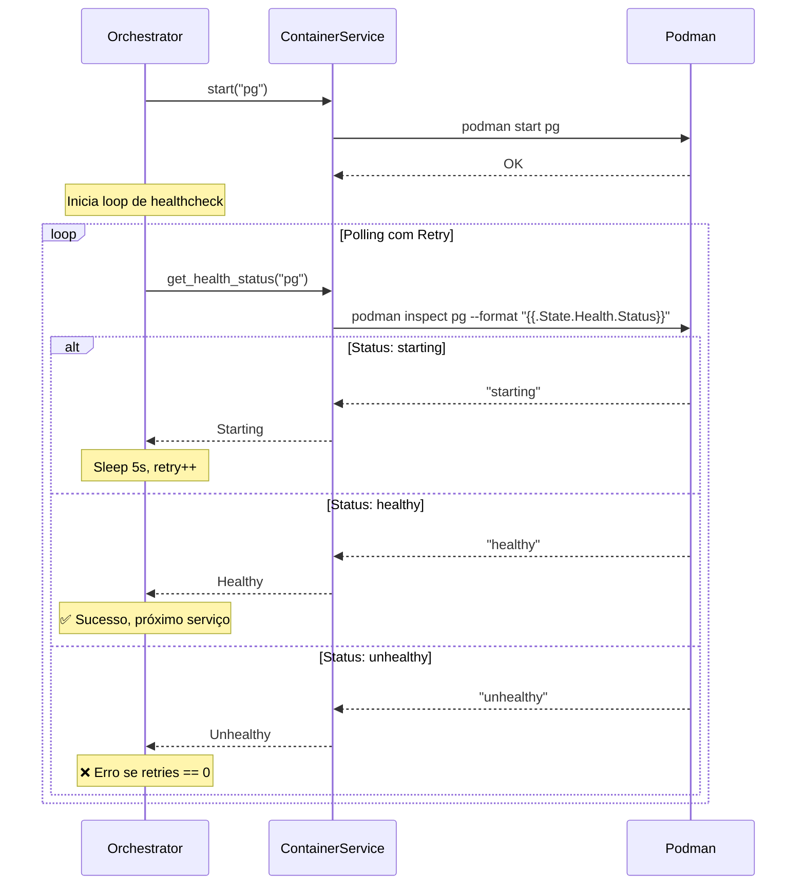

**Código** (`src/services/orchestrator.rs:91-123`):

```rust
pub fn start_all(&self, services: &[Service]) -> Result<()> {
    // 1. Start todos os containers
    for svc in services {
        self.container_service.start(&svc.name)?;
    }

    println!("💖 Verificando healthchecks...");

    // 2. Wait for healthchecks
    for svc in services {
        if svc.healthcheck_command.is_none() {
            continue;  // Sem healthcheck, assume ready
        }

        print!("  🩺 Aguardando {} ficar saudável...", svc.name);

        let mut retries = svc.healthcheck_retries.unwrap_or(3);
        let interval_str = svc.healthcheck_interval.as_deref().unwrap_or("1s");
        let interval = parse_duration(interval_str)?;

        loop {
            match self.container_service.get_health_status(&svc.name)? {
                ContainerHealthStatus::Healthy => {
                    println!(" ✅ Saudável!");
                    break;
                }
                ContainerHealthStatus::Starting => {
                    print!(".");
                    std::io::stdout().flush()?;
                }
                ContainerHealthStatus::Unhealthy => {
                    println!(" ❌ Não saudável.");
                    if retries == 0 {
                        bail!("Serviço '{}' falhou no healthcheck", svc.name);
                    }
                    retries -= 1;
                }
                ContainerHealthStatus::NotApplicable => {
                    println!(" ⚠️ Sem healthcheck configurado");
                    break;
                }
                _ => {}
            }

            thread::sleep(interval);
        }
    }

    println!("✅ Todos os serviços iniciados e saudáveis");
    Ok(())
}
```

#### Duration Parsing

```rust
fn parse_duration(s: &str) -> Result<Duration> {
    if s.ends_with("s") {
        let secs = s.trim_end_matches("s").parse::<u64>()?;
        Ok(Duration::from_secs(secs))
    } else if s.ends_with("m") {
        let mins = s.trim_end_matches("m").parse::<u64>()?;
        Ok(Duration::from_secs(mins * 60))
    } else {
        bail!("Invalid duration format: {}", s)
    }
}
```

**Exemplos**:

- `"5s"` → `Duration::from_secs(5)`
- `"2m"` → `Duration::from_secs(120)`

**Referência**: `src/services/orchestrator.rs:91-123`

### 8.3 Start/Stop Workflows

**Start Workflow**:

1. Filter services por kind (se especificado)
2. Ensure all created (`ContainerState != NotCreated`)
3. Start all containers
4. Poll healthchecks com retry
5. Ensure Hub running

**Stop Workflow**:

1. Get all container names
2. Stop each (ignora erros)
3. Continue mesmo se algum falhar

**Graceful Degradation**: Orquestrador continua mesmo se serviços individuais falharem.

---

## 9. Build System

### 9.1 Image Construction

O Devobox usa uma **base Debian Bookworm** com multi-stage optimization:

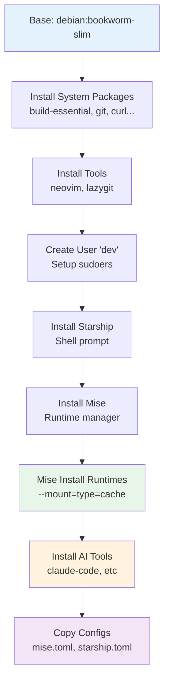

**Containerfile** (`config/default_containerfile.dockerfile`):

```dockerfile
FROM debian:bookworm-slim

# 1. System packages com cache mount
RUN --mount=type=cache,target=/var/cache/apt \
    --mount=type=cache,target=/var/lib/apt \
    apt-get update && apt-get install -y \
    build-essential git curl wget \
    libssl-dev libpq-dev redis-tools postgresql-client

# 2. Tools
RUN wget https://github.com/neovim/neovim/releases/download/v0.11.5/nvim-linux64.tar.gz
RUN tar -xzf nvim-linux64.tar.gz && ln -s /nvim-linux64/bin/nvim /usr/local/bin/nvim

# 3. User dev
RUN useradd -m -s /bin/bash dev && \
    echo "dev ALL=(ALL) NOPASSWD:ALL" > /etc/sudoers.d/dev

USER dev
WORKDIR /home/dev

# 4. Starship
RUN curl -sS https://starship.rs/install.sh | sh -s -- -y

# 5. Mise
RUN curl https://mise.jdx.dev/install.sh | sh
ENV PATH="/home/dev/.local/bin:$PATH"

# 6. Mise install runtimes (com cache)
COPY --chown=dev:dev mise.toml /home/dev/.config/mise/config.toml
RUN --mount=type=cache,target=/home/dev/.cache/mise \
    mise install

# 7. AI Tools
RUN --mount=type=cache,target=/home/dev/.npm \
    mise use -g npm:@anthropic-ai/claude-code

# 8. Shell config
RUN echo 'eval "$(starship init bash)"' >> ~/.bashrc && \
    echo 'eval "$(mise activate bash)"' >> ~/.bashrc

CMD ["/bin/bash"]
```

### 9.2 Cache Optimization

O build usa **cache mounts** para acelerar:

```dockerfile
# Cache de apt packages
--mount=type=cache,target=/var/cache/apt

# Cache de mise downloads
--mount=type=cache,target=/home/dev/.cache/mise

# Cache de npm packages
--mount=type=cache,target=/home/dev/.npm
```

**Benefício**: Downloads são feitos uma vez, reutilizados em builds subsequentes.

### 9.3 Build Flow

**Código** (`src/cli/builder.rs:50-150`):

```rust
pub fn build(config_dir: &Path, skip_cleanup: bool) -> Result<()> {
    let app_config = load_app_config(config_dir)?;
    let runtime = Arc::new(PodmanAdapter::new());
    let container_service = Arc::new(ContainerService::new(runtime.clone()));
    let system_service = Arc::new(SystemService::new(runtime.clone()));
    let orchestrator = Orchestrator::new(container_service.clone(), system_service.clone());

    // 1. Cleanup opcional
    if !skip_cleanup {
        orchestrator.cleanup(&CleanupOptions {
            containers: true,
            images: true,
            volumes: false,
            build_cache: false,
            nuke: false,
        })?;
    }

    // 2. Build image
    let image_name = &app_config.build.image_name;
    let containerfile = config_dir.join(&app_config.paths.containerfile);

    println!("🏗️  Building image {}...", image_name);
    system_service.build_image(image_name, &containerfile, config_dir)?;

    // 3. Validate mise.toml
    let mise_path = config_dir.join(&app_config.paths.mise_toml);
    validate_mise_toml(&mise_path)?;

    // 4. Resolve services (com dependencies)
    let services = resolve_all_services(config_dir, &app_config)?;

    // 5. Create service containers
    for svc in &services {
        println!("📦 Criando container para {}...", svc.name);
        container_service.recreate(&svc.to_spec())?;
    }

    // 6. Create Hub container
    let hub_spec = ContainerSpec {
        name: &app_config.container.name,
        image: image_name,
        ports: &[],
        env: &[],
        network: Some("host"),
        userns: Some("keep-id"),
        security_opt: Some("label=disable"),
        workdir: Some("/home/dev"),
        volumes: &[code_mount()?, ssh_mount()?],
        extra_args: &["-it"],
        healthcheck_command: None,
        healthcheck_interval: None,
        healthcheck_timeout: None,
        healthcheck_retries: None,
    };

    println!("📦 Criando Hub container...");
    container_service.recreate(&hub_spec)?;

    println!("✅ Build concluído!");
    Ok(())
}
```

**Referência**: `src/cli/builder.rs:50-150`

---

## 10. CLI Interface

### 10.1 Hierarquia de Comandos

```
devobox [OPTIONS] [COMMAND]

SETUP:
├── init [--skip-cleanup]       Full setup: install + build
├── install                     Copy config files apenas
└── build/rebuild [--skip-cleanup]  Build image + containers

RUNTIME:
├── shell [--with-dbs] [--auto-stop]  Open shell (default)
├── dev [--auto-stop]           Shell com databases
├── up [--dbs-only|--services-only]   Start containers
├── down                        Stop all containers
└── status                      Show container status

MANAGEMENT:
├── service {start|stop|restart|status} [NAME]
├── db {start|stop|restart|status} [NAME]
└── cleanup [--containers|--images|--volumes|--build-cache|--nuke|--all]

OPTIONS:
  --config-dir <PATH>           Override config directory
  -d, --with-dbs                Initialize databases
  --auto-stop                   Stop containers on exit
```

**Referência**: `src/main.rs:30-100`

### 10.2 Command Flows

#### devobox init

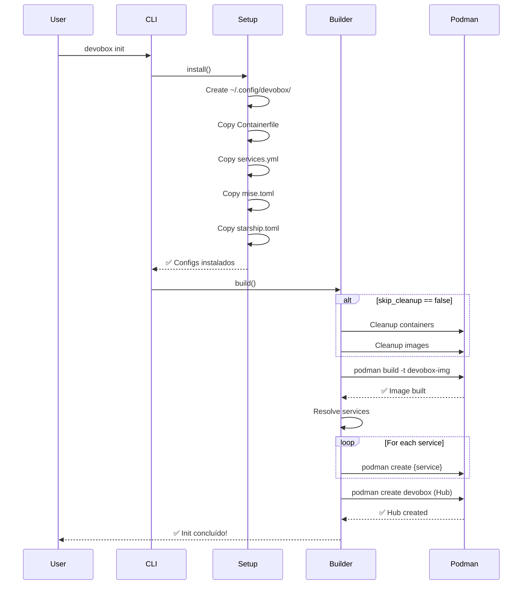

**Referência**: `src/cli/setup.rs`, `src/cli/builder.rs`

#### devobox up

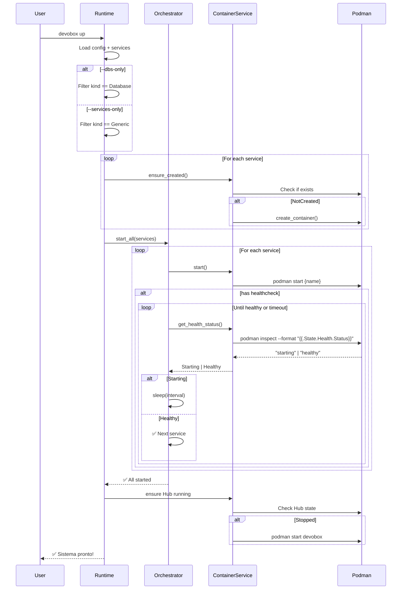

**Referência**: `src/cli/runtime.rs:up()`, `src/services/orchestrator.rs:start_all()`

#### devobox shell

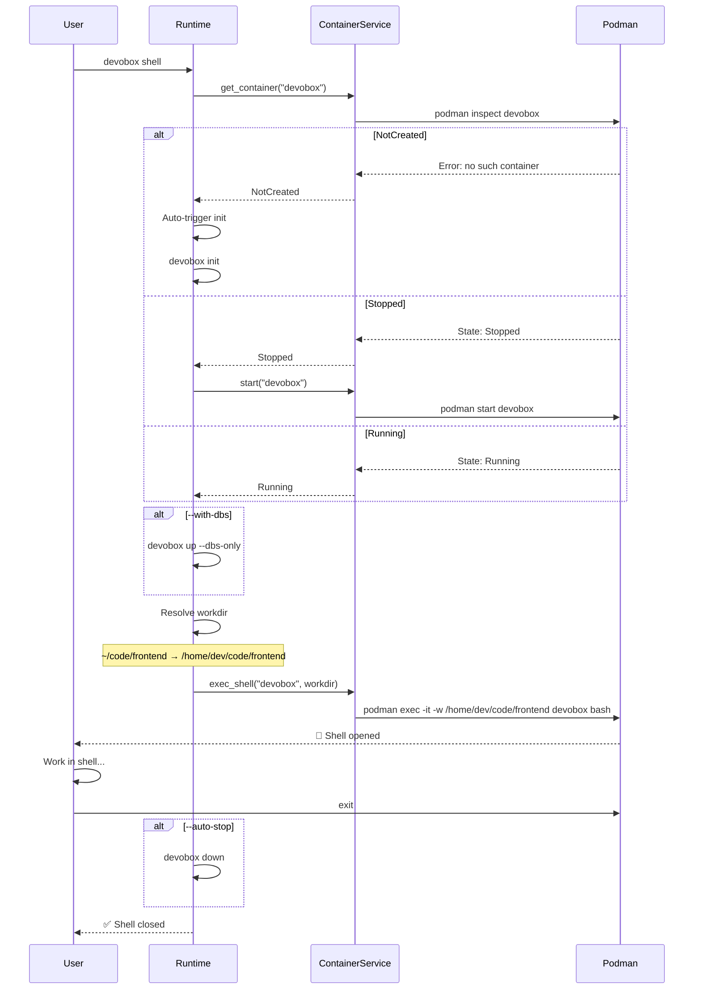

**Referência**: `src/cli/runtime.rs:shell()`

---

## 11. Padrões Arquiteturais

### 11.1 Trait-Based Abstraction

O sistema usa **traits** para abstrair dependências de infraestrutura:

```rust
// Domain define a interface
pub trait ContainerRuntime: Send + Sync {
    fn start_container(&self, name: &str) -> Result<()>;
    // ...
}

// Infrastructure implementa
pub struct PodmanAdapter;
impl ContainerRuntime for PodmanAdapter {
    fn start_container(&self, name: &str) -> Result<()> {
        podman(["start", name], "starting container", true)
    }
}

// Services usam a abstração
pub struct ContainerService {
    runtime: Arc<dyn ContainerRuntime>,  // Trait object
}
```

**Benefícios**:

- Testabilidade: Mock runtime para testes
- Flexibilidade: Trocar Podman por Docker facilmente
- Inversão de dependência: Domain não depende de Infra

### 11.2 Singleton Pattern (Hub)

O Hub implementa **Singleton implícito**:

```rust
pub fn shell(&self) -> Result<()> {
    let container = self.runtime.get_container("devobox")?;

    // Se não existe, cria (init)
    // Se existe mas parado, inicia
    // Se rodando, apenas injeta shell

    match container.state {
        NotCreated => self.init()?,
        Stopped => self.runtime.start_container("devobox")?,
        Running => {},
    }

    self.runtime.exec_shell("devobox", workdir)?;
}
```

**Garante**: Apenas um Hub por sistema, reutilizado entre sessões.

### 11.3 Cascading Configuration

Configs são merged em ordem:

```rust
fn load_app_config(config_dir: &Path) -> Result<AppConfig> {
    // 1. Defaults
    let mut config = AppConfig::default();

    // 2. Global override
    if let Ok(global_config) = load_config(config_dir) {
        config = config.merge(global_config);
    }

    // 3. Local override
    let local_path = env::current_dir()?.join("devobox.toml");
    if local_path.exists() {
        let local_config = load_config(&local_path)?;
        config = config.merge(local_config);
    }

    Ok(config)
}
```

### 11.4 Graceful Degradation

O orchestrator **continua mesmo com falhas**:

```rust
pub fn start_all(&self, services: &[Service]) -> Result<()> {
    for svc in services {
        // Não falha se um serviço falhar
        if let Err(e) = self.container_service.start(&svc.name) {
            eprintln!("⚠️  Erro ao startar {}: {}", svc.name, e);
            continue;  // Próximo serviço
        }
    }
    Ok(())
}
```

### 11.5 Runtime Context Encapsulation

Cada execução cria um **Runtime context**:

```rust
pub struct Runtime {
    global_config_dir: PathBuf,
    app_config: AppConfig,
    services: Vec<Service>,
    container_service: Arc<ContainerService>,
    orchestrator: Orchestrator,
}

impl Runtime {
    pub fn new(config_dir: PathBuf) -> Result<Self> {
        let app_config = load_app_config(&config_dir)?;
        let services = resolve_all_services(&config_dir, &app_config)?;

        let runtime = Arc::new(PodmanAdapter::new());
        let container_service = Arc::new(ContainerService::new(runtime.clone()));
        let system_service = Arc::new(SystemService::new(runtime.clone()));
        let orchestrator = Orchestrator::new(container_service.clone(), system_service);

        Ok(Self {
            global_config_dir: config_dir,
            app_config,
            services,
            container_service,
            orchestrator,
        })
    }
}
```

**Encapsula**: Config, services, dependencies em um único contexto imutável.

---

## 12. Referências de Código

### Mapa de Arquivos

| Arquivo                             | Linhas | Responsabilidade | Principais Funções                                          |
| ----------------------------------- | ------ | ---------------- | ----------------------------------------------------------- |
| `src/main.rs`                       | 150    | CLI entry point  | Command definitions (Clap)                                  |
| `src/cli/runtime.rs`                | 350    | Runtime commands | shell(), up(), down(), status(), container_workdir()        |
| `src/cli/builder.rs`                | 200    | Build system     | build(), code_mount(), ssh_mount()                          |
| `src/cli/setup.rs`                  | 100    | Setup command    | install()                                                   |
| `src/services/orchestrator.rs`      | 150    | Orchestration    | start_all(), stop_all(), cleanup()                          |
| `src/services/container_service.rs` | 120    | Container ops    | ensure_running(), start(), stop(), recreate()               |
| `src/services/system_service.rs`    | 80     | System ops       | build*image(), prune*\*()                                   |
| `src/infra/podman_adapter.rs`       | 250    | Podman impl      | create_container(), get_container(), exec_shell()           |
| `src/infra/config.rs`               | 400    | Configuration    | load_app_config(), resolve_all_services(), parse_services() |
| `src/domain/container.rs`           | 100    | Domain entities  | Service, ServiceKind, ContainerSpec, ContainerState         |
| `src/domain/traits.rs`              | 50     | Abstractions     | ContainerRuntime trait, ContainerHealthStatus               |

### Pontos de Entrada Principais

1. **CLI Parsing**: `src/main.rs:30-100`
2. **Shell Command**: `src/cli/runtime.rs:150-250`
3. **Build Flow**: `src/cli/builder.rs:50-150`
4. **Healthcheck Polling**: `src/services/orchestrator.rs:91-123`
5. **Config Resolution**: `src/infra/config.rs:200-300`
6. **Container Creation**: `src/infra/podman_adapter.rs:70-120`

### Funções Críticas

**Network Decision**:

```rust
// src/cli/builder.rs:87
network: Some("host"),  // Hub sempre usa host network
```

**User Namespace**:

```rust
// src/cli/builder.rs:88
userns: Some("keep-id"),  // Mapeia UID container → host
```

**Port Mapping**:

```rust
// src/infra/podman_adapter.rs:93-96
for port in spec.ports {
    args.push("-p");
    args.push(port);  // "host:container"
}
```

**Healthcheck Loop**:

```rust
// src/services/orchestrator.rs:100-120
loop {
    match get_health_status(svc.name)? {
        Healthy => break,
        Starting => { sleep(interval); retry++; }
        Unhealthy if retries == 0 => bail!(),
        // ...
    }
}
```

**Dependency Resolution**:

```rust
// src/infra/config.rs:250-280
pub fn resolve_all_services(
    start_dir: &Path,
    start_config: &AppConfig
) -> Result<Vec<Service>> {
    // Recursively load from include_projects
    // Track visited paths (cycle prevention)
}
```

---

## 13. Decisões Arquiteturais

### Por que Podman em vez de Docker?

**Decisão**: Usar Podman como container runtime.

**Razões**:

1. **Daemonless**: Não requer daemon rodando em background
2. **Rootless**: Roda sem root por padrão
3. **OCI-compliant**: 100% compatível com Docker
4. **Security**: User namespaces nativos
5. **CLI-compatible**: Alias `podman` → `docker` funciona

**Trade-off**: Menor adoção que Docker, alguns bugs edge cases.

### Por que Host Network no Hub?

**Decisão**: Hub sempre usa `--network host`.

**Razões**:

1. **Performance**: Zero overhead de NAT
2. **Simplicidade**: Portas funcionam como no host
3. **Dev Experience**: Apps rodam como se estivessem nativos
4. **Port Sharing**: Múltiplos processos compartilham localhost

**Trade-off**: Conflitos de porta devem ser gerenciados manualmente.

### Por que Bridge Network em Services?

**Decisão**: Services usam bridge network com port mapping.

**Razões**:

1. **Isolamento**: Databases não poluem namespace do Hub
2. **Controle**: Port mapping explícito e documentado
3. **Segurança**: Containers isolados por padrão

**Trade-off**: Overhead de NAT, portas devem ser mapeadas.

### Por que Sem DNS Service Discovery?

**Decisão**: Comunicação apenas via `localhost:port`.

**Razões**:

1. **Simplicidade**: Sem complexidade de DNS resolver
2. **Portabilidade**: URLs funcionam no host e containers
3. **Explicitness**: Portas documentadas em services.yml
4. **Zero-config**: Funciona out-of-the-box

**Trade-off**: Portas hardcoded, não há service names resolution.

### Por que Rust?

**Decisão**: Implementar CLI em Rust.

**Razões**:

1. **Performance**: Binário compiled, startup rápido
2. **Type Safety**: Previne bugs em compile-time
3. **Cross-platform**: Compila para Linux, macOS, Windows
4. **Ecosystem**: Clap, serde, anyhow são excelentes
5. **Binary Distribution**: Single binary, fácil instalar

**Trade-off**: Curva de aprendizado, compile times.

### Por que Singleton Hub?

**Decisão**: Um único Hub container reutilizado.

**Razões**:

1. **Economia de RAM**: Um container Linux em vez de N
2. **Shared State**: Environment e tools compartilhados
3. **Fast Access**: `podman exec` é instantâneo
4. **Simplicity**: Gerenciar um container é mais fácil

**Trade-off**: Menos isolamento entre projetos.

### Limitações Conhecidas

1. **Porta Conflicts**: Hub usa host network, portas podem conflitar
2. **Estado Compartilhado**: Todos os projetos compartilham env do Hub
3. **Sem Hot Reload de Config**: Mudanças em config requerem rebuild
4. **Podman-Only**: Não funciona com Docker (por enquanto)
5. **Linux/macOS Only**: Windows requer WSL2

### Possíveis Melhorias Futuras

1. **Multi-Hub Support**: Múltiplos Hubs isolados por projeto
2. **Docker Support**: Adapter para Docker runtime
3. **Config Validation**: JSON Schema para services.yml
4. **Dashboard**: UI web para gerenciar containers
5. **Logs Aggregation**: Centralizar logs de todos os serviços
6. **Template System**: Scaffolding de projetos

---

## Conclusão

O Devobox implementa uma arquitetura **simples, eficiente e bem estruturada** que prioriza:

- **Developer Experience**: CLI ergonômico, feedback visual, zero-config
- **Performance**: Host network, bind mounts diretos, singleton Hub
- **Isolation**: Bridge network para services, user namespaces
- **Maintainability**: Clean architecture, trait-based abstractions
- **Flexibility**: Configuração cascata, dependency resolution

A arquitetura **Hub & Spoke** com **rede híbrida** (Host + Bridge) oferece o melhor dos dois mundos: performance nativa para desenvolvimento e isolamento para infraestrutura.

---

**Última atualização**: Dezembro 2025  
**Versão**: 0.5.0  
**Mantenedores**: [@joaoalves](https://github.com/joaoalves)
